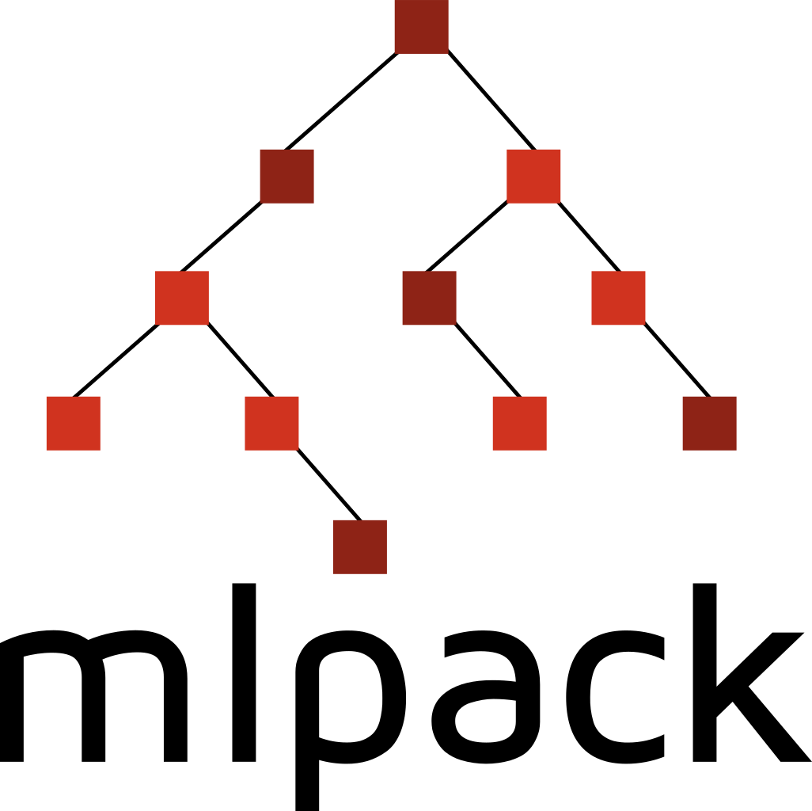
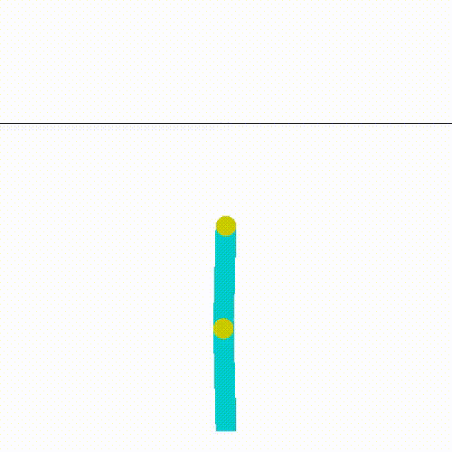
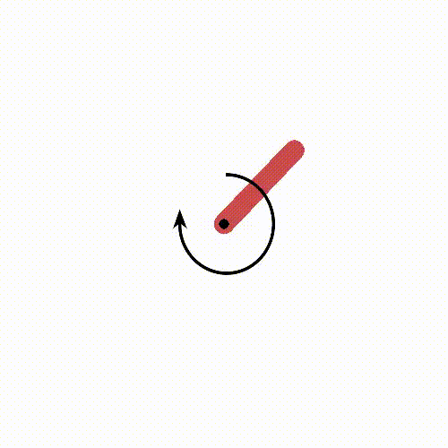
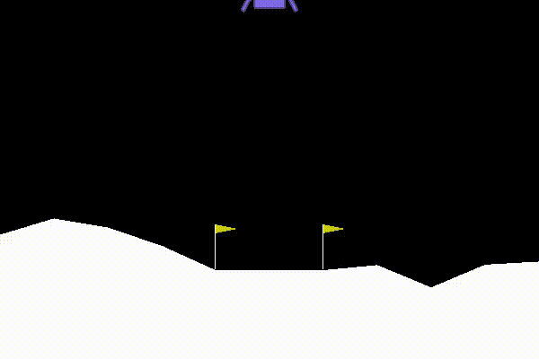

# Addition of Rainbow and Soft Actor-Critic to RL codebase

Hi! Maintaining mlpack's tradition, this page contains weekly updates of my contributions at mlpack during Google Summer of Code(2020).

Here's the output of the agents that I implemented this summer, solving some of the classical reinforcement learning environments.

## Project Abstract:
I spent my summers this year, working on adding **Rainbow** [Hessel et al., 2017](https://arxiv.org/abs/1710.02298) and **Soft Actor-Critic** [Haarnoja et al., 2019](https://arxiv.org/abs/1812.05905) to the existing reinforcement learning codebase of **[mlpack](http://mlpack.org/)**.

I feel that these are one of the most in-demand and recent algorithms, whose implementation in [mlpack](http://mlpack.org/) was crucial.

Here's the summary of what I've accomplished at the end of this summer.

1. Improved the current QLearning implementation.
2. Implemented Rainbow as an improvement on DQN. This includes adding the following as extensions:
    - Dueling DQN
    - Noisy DQN
    - Categorical DQN
    - N-step DQN
3. Wrote test cases for each of the implementations, after tuning hyperparameters and testing each for several runs.
4. Implemented Soft Actor-Critic (SAC) for continuous action space, along with its tests.
5. Created detailed documentation for all the above implementations.
6. Created documented Jupiter notebooks explaining [solved examples](https://github.com/mlpack/examples) of agents solving classical reinforcement learning problems, using a TCP API to communicate with an [OpenAI gym](https://gym.openai.com/) instance.

*The original project proposal can be found on the GSoC website [here](https://summerofcode.withgoogle.com/projects/#4766925516701696).*

## Weekly Progress:
### [Week 1  - Layout for Dueling and Noisy DQNs](week-01/week-01.md)
### [Week 2 and 3  - Finishing Dueling and Noisy DQNs](week-02-and-03/week-02-and-03.md)
### [Week 4 and 5  - Completed Multi-step DQN, C51 almost ready](week-04-and-05/week-04-and-05.md) 
### [Week 6 and 7  - Training on gym_tcp_api, Layout for Soft-actor-critic](week-06-and-07/week-06-and-07.md)
### [Week 8 and 9  - Soft-Actor basic implementation complete, making solved example notebooks](week-08-and-09/week-08-and-09.md)
### [Week 10 and 11  - C51 merged, Soft-Actor-Critic almost complete, three new solved notebooks added, bug fixes 🐛🐛](week-10-and-11/week-10-and-11.md)
### [Week 12 - Wrapping up](week-12/week-12.md)

## Work Progress:
Links to open and merged pull requests can be found [here](PRs.md).