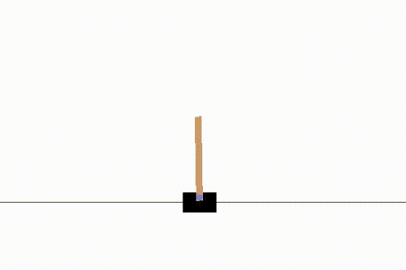

# Week 1 

  18th May - 24th May , 2020

## Work done
- By making a [few](https://github.com/mlpack/mlpack) changes in mlpack's Q_learning implementation, was able to get the Q_learning agent train on mlpack's implementation, and then run on a gym environment with visual rendering using https://github.com/zoq/gym_tcp_api.
- After discussion with mentors and tuning hyperparameters, was able to finally ['solve'](https://github.com/mlpack/examples/pull/90) [cartpole](https://gym.openai.com/envs/CartPole-v0/) environment, by achieving avg >195 reward for 100 consecutive episodes.

- Completed a skeleton layout of the Dueling network.
- Gave a read to the [Noisy-Network paper](https://arxiv.org/abs/1706.10295), then added the layout for Noisy Layer, to be used in NoisyDQN implementation.
- Did some matrix calculus, in order to better understand gradient flow in nn, especially for branched networks.
- Dueling requires the network to be branched, so I thought by passing gradients, it could be done easily. Turns out, gradients we receive from one network are not in the format expected by the other network. [link](https://github.com/mlpack/mlpack/pull/2414#discussion_r428855607) :(
- finally after getting some help from @zoq, @kartikdutt18 and @favre49, found a way to branch off the network without having to manually deal with gradients, using Sequential to create the advantage and value networks, and concat to merge them, and add to the feature network.

## I'd Like to share :)
Just before begining with GSoC work, I installed Ubuntu'20 (which I found to be so much better than 16.04!). And after the recent boost of additional 8gb RAM, I really enjoy working on my setup. :)

Also, instead of music, this week I'd like to suggest 'Kurzgesagt – In a Nutshell', an educational channel on YouTube, who's videos are a delight to watch!

Thanks for reading!
