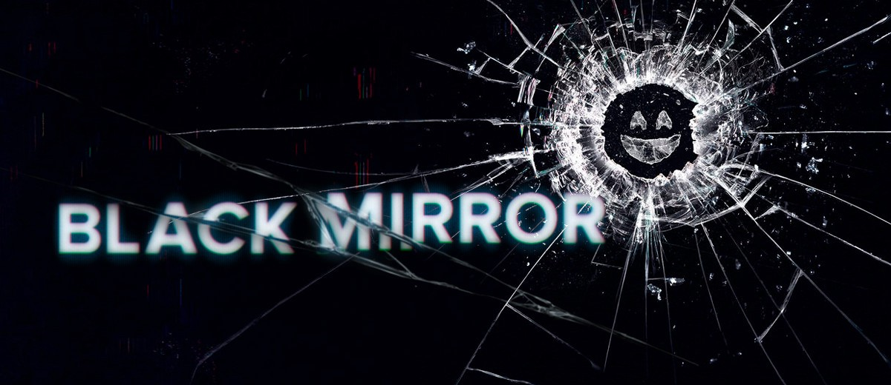

# Week 8 and 9

  13th - 26th July , 2020.

## Important changes:

There has been a small yet significant change in the example notebooks for q_learning. Instead of using no of episodes to limit training, we now use num of steps. This provides a better way of keeping track of the network's performance.

## Work done:
- Added update mechanism for policy network, with the softUpdate function, thereby completing basic SAC implementation.
- Updated docs for q_learning, in regards to the recent changes.
- Added an example notebook for Acrobot trained using 3-step Double DQN with Prioritized Replay.
- Resolved conflicts in PPO branch, and fixed some bugs relating to recent changes.
- Finally got dqn to solve mountain car, by changing the reward function and tweaking hyperparameters.
- Tried to get the basic SAC implementation to converge on Pendulum, but couldn't. Maybe more tuning of hyperparameters are required.

## Problems faced:

While preparing the DQN to solve Mountain car, the agent was not able to convege in all the runs. This was because the reward function for the environment is designed in such a way. 

Only if the car is able to climb up the the hill i.e. reach `state[0] > 0.5` will the episode terminate. Until that, the agent receives a reward of `-1` for each step.

Because the agent’s reward never changes until completion of the episode, it is difficult for our algorithm to improve until it randomly reaches the top of the hill.

So, I tried tweaking the reward function, by giving an additional `0.5` reward for every time the agent managed to drag the car in the backward direction. This was important to gain momentum to climb the hill.
This made the process more sample efficient. I was finally able to use dqn with fewer steps to achieve good results:

I also realized the importance of network initialization. While training mountain car with the custom reward function, the agent started performing well only after `500` episodes. This was happening because I was using `GaussianInitialization` with standard deviation as `0.001`. This was a standard convention used in the tests, so I didn't bother to change it earlier. But once I changed it to `1`, the agent began training just after `75` episodes (which earlier was taking `500` episodes!).

## Movie suggestions:

I think all tech enthusiasts must, atleast once, watch 'Black Mirror'. It shows how the near future can be dangerous and dark, if we are not careful.

But, if you are feeling low, I suggest watching `Wonder`. I'm sure it will cheer you up :)

Thanks for reading, and have a good one ;)