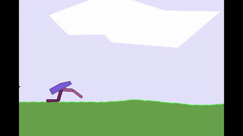
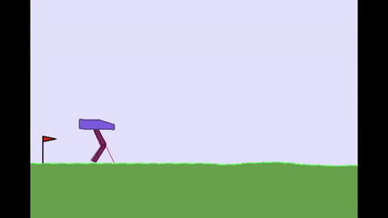
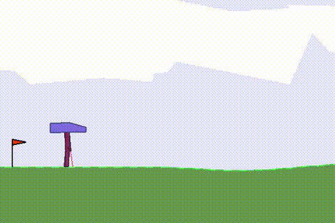

# Week 12

  10th August - 23rd August , 2020.

Since I had started early, I had one more week before the final work submission. So I thought, why not include this week's contributions and present the results together. So, here's my last blog post in this series. I hope u like it!

## Contributions:

As a quick recap, the I was able to complete the extensions: Noisy DQN, N-step, Categorical and Dueling, on time(according to the proposed timeline). Since I had started working on Soft Actor-Critic while developing those, it gave me a head start. So, by week 9, my basic implementation was ready. But the real challenge was to find the hidden bugs in Categorical and Soft Actor-Critic, which caused all the agents to fail miserably. The last two weeks were spent exclusively on searching for them, and eliminating them. But eventually the tests passed and both implementations are now a part of mlpack!

This week was mostly spent on training and testing Soft Actor-Critic on Bipedal Walker. At first, I tried training the agent on jupyter, but the time taken for each step was huge (3 hrs to train for 200 episodes!). Since the state space of the Bipedal Walker contains `24` independent spaces, the agent had to have a good number of hidden layer nodes (atleast `128` according to intuition). So, there was no other option but to train the agent locally and add the trained model to the notebook for testing.

So, I started traing the agent locally.

As expected, initially after around ~100 episodes, the agent learnt to not fall over by spreading its legs and trying to take small steps forward.

Finally, after training for ~300 episodes, the agent was able to make the biped walk, although the gait was not satisfactory.

I tried training for longer, but the performance degraded on training beyond that. So, in order to get some better results, we are left with the only option of making the network deeper. This is quite expected, after-all walking and gait sequence generation is quite complex a task as compared to say balancing an inverted pole on a cart, or a pendulum upside down.

This however increases the training time a lot, making it impossible for me use my laptop for training. I tried training the agent overnight, but after 2 hrs, my machine got super heated and I had the fear of losing my dear laptop. 🧑‍💻❤️

But, training the network remotely on a different machine should do the job. I hope to see mlpack's SAC making giant leaps on the Bipedal Walker environment soon.

*Update 29th August: After getting the agent trained with 2-hidden layers for both Q and policy networks, results were much better. Here's the output after 620 episodes of training:*

## Issue fixed:

A small unnoticed issue was that SAC had not been tested on a multi-action environment like bipedal. But with some minor adjustments [PR 2569](https://github.com/mlpack/mlpack/pull/2569) in the backward pass, the issue was finally resolved.

## Concluding:

I am so glad to see the [PRs](../PRs.md) page. Most of my contributions this summer are now a part of mlpack, something I dreamt of while starting contributing to mlpack. For this, I'm in debt of gratitude to Marcus and Rahul, for those overnight (or sometimes within minutes) reviews, suggestions and comments.
